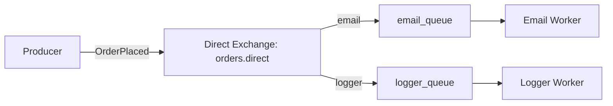

# Distributed Order Processing Using RabbitMQ

Event-driven order processing with RabbitMQ. The producer publishes an `OrderPlaced` event, and two consumers handle email receipts and log tickets in parallel.

## Architecture and Workflow



- Order API (Producer): Accepts orders and publishes an `OrderPlaced` event to RabbitMQ.
- RabbitMQ (Broker): Uses a direct exchange to route messages to specific queues.
- Notification Service (Consumer A): Listens to `email_queue` and simulates sending HTML receipts.
- Logger Service (Consumer B): Listens to `logger_queue` and simulates printing order details.

## Tech Stack

- Language: Python 3.x
- Library: Pika (RabbitMQ client)
- Message Broker: RabbitMQ 3.x (Management plugin enabled)
- Infrastructure: Docker and Docker Compose

## Getting Started

### Prerequisites

- Docker
- Python 3.x

### Infrastructure Setup

Start RabbitMQ with the management dashboard:

```bash
docker compose up -d
```

Management UI: http://localhost:15672 (Login: guest / guest)

### Installation

```bash
# Setup virtual environment
python -m venv venv
source venv/bin/activate  # Windows: venv\Scripts\activate
pip install -r requirements.txt
```

### Running the System

Open three terminals:

```bash
# Window 1 (Email Worker)
python src/workers/email_worker.py

# Window 2 (Logger Worker)
python src/workers/logger_worker.py

# Window 3 (Producer)
python src/producer.py 1001 pizza@example.com
```

### Stress Test (for queue spikes)

```bash
python scripts/stress_test.py
```

Optional flags:

```bash
python scripts/stress_test.py --count 5000 --rate 200
```

## Notes

- The producer arguments may vary depending on your implementation. Adjust the CLI arguments as needed.
- Ensure RabbitMQ is running before starting any worker or producer.
